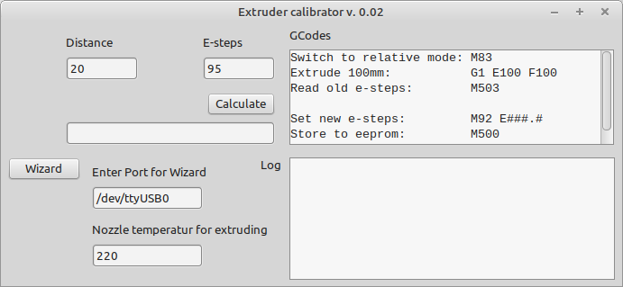

# Extruder calibrator

Application to calibrate the extruder steps for a 3D printer

Features: 
- Wizard to automated calibrate the e steps

Dependencies:
- Synapse ( http://www.ararat.cz/synapse/doku.php/download ) 
