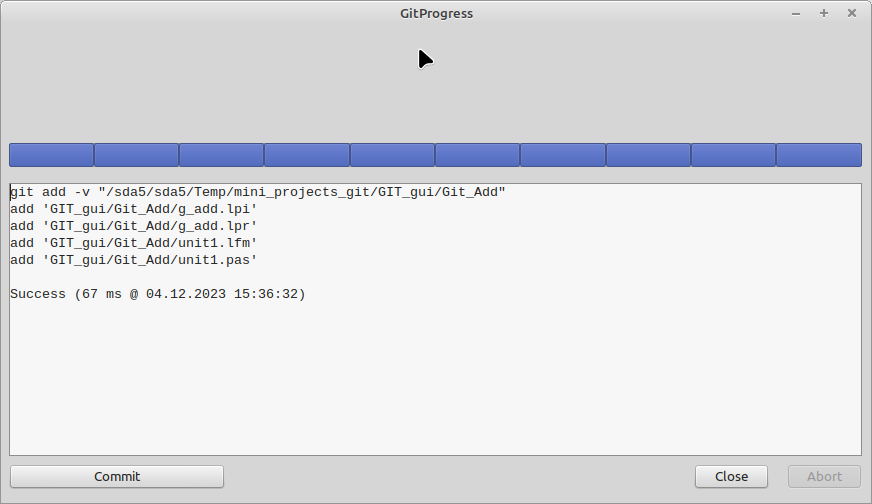
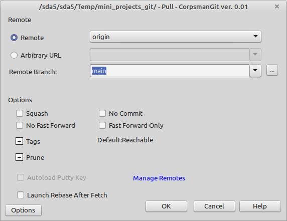

# GIT gui

This is plattform independand GIT gui that tries to look as close as possible to the Tortoise GIT toolchain.

! Attention !

As the aim is to "look" as close as possible, this does not mean, that the functionality is the same (or complete).

### Whats the goal of this gui if it is not a fully working toolchain ?

The main goal is to provide the same look and feel like the Tortoise GIT toolchain, but available on all Plattforms Lazarus can compile to (tested only in Windows and Linux Mint). As there is not the goal to have a 100% functionality some experienced user may miss features. Beginners or at least typically usecases should be happy with the available features. These features are:

 - ADD: add files to staging area
 - Commit: write and edit commit messages (including ament, exluding submodules)
 - Show Log: show the last commit messages
 - Pull: pull the actual branch of a already cloned repository
 - Push: push the actual branch to a remot repository

Also included:

 - Installation guide / scripts for Linux Mint Mate

Additional features:

All dialogs have a additional "Options" button, which will give access to some repository settings (keep in mind if you want to edit the system settings you need to be root).

Following the preview of the different tools:

## Git add

Add files which are given as parameters to the actual repositories staging area

Capabilities:

Call from within a GIT repository and pass one ore more files / folders, they will be added to the staging area of the repository.

## Git commit

Enter your commit text, select which files should be committed

Capabilities:
- add files
- revert
- add to ignore list
- explore to
- amend last commit (only text, not files)

## Git pull

Pull the actual branch of a repository

Capabilities:

Only thing that is working is the Remote branch selector, all other elements are only "dummy" and not working.

## Git push

Push the actual commits of a repository

Capabilities:

only thing that is working is the "force" and "Include Tags" checkbox as also the branch selecting