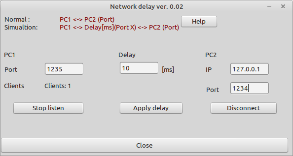

# Network delay

This tools simulates a delayed network. This is usefull if you want to simulate a WAN connection on your local computer.

Features:
- Delay network packets
- TCP-IP only

### How to use:
- start the application
- define listening port and start listen
- set delay value
- connect to the target using ip and port settings

