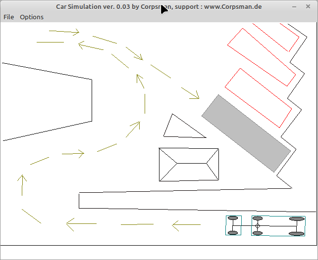

# Parken

This demo shows how to implement a chain of "vehicles" that are controlled by a single force.

Features:
- define single and multiple wheeled "devices"
- load / save scenaries

Howto:
- start by clicking file -> new and select a demo scene from the data folder.
- use the inbuild editors to define a scanary