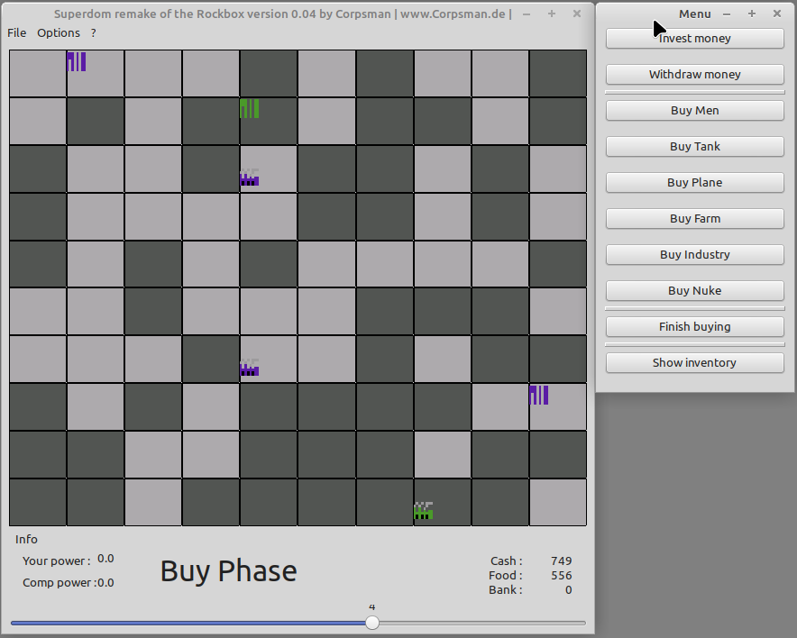

# Super domination (Superdom)

Superdom is a C-Port of the Superdom version which is part of [Rockbox](https://www.rockbox.org/).

The original source code is located under: https://git.rockbox.org/cgit/rockbox.git/tree/apps/plugins/superdom.c 

The code was taken at the version from 2020-07-22 (so every update on rockbox side that was made after that date is not part of this port).

## Description
Superdom is a turn-based "world domination" game with the goal to rule the world. At the beginning the "world" is populated randomly. To win the game you need to dominate the world be defeating your opponent.

The game consists of different elements:

* Bank: invest and withdraw money from turn to turn
* Cash: will be created by the bank or industries, is needed to by everything 
* Food: will be produced by farms and eaten by men
* Farms : produce food to feed the men
* Industries : produce money to pay everything
* Men, Tank, Plane: give power to a field, can be moved
* Nuke: The ultimate dead bringing weapon

## Gameplay
Each round starts with the "buy" phase. After which comes the "move" phase finished by the "war" phase. This will continue until a winner is determined.

### Buy phase
At the beginning of the buy phase the farms will produce food and the industries will generate cash.

During the buy phase you are allowed to:

* invest and withdraw money from the bank
* buy Industry, Farm, Men, Tank, Plane or Nukes

#### How to by something:
To buy something, first select the world field the buyed item should be located on, then click the corresponding "buy" button. If you can pay the full price for the selected item, the item will be placed on the field of the world.
You can buy as many items as you want and afford. 

See "?" -> "Gameplay" for prices

The buy phase is closed by clicking the "Finish buying" button. This will automatically trigger the Ai's buy phase which will be executed. After that the move phase starts.

### Move phase

By default you are allowed to do 2 free moves during the move phase (see settings to change this). If wanted you can by additional moves.

- Men can only move to adjacent fields
- Tank can only move to adjacent fields
- Plane can move to any fields 

If you have a nuke you can launch it now by first selecting the field that contains the nuke you want to launch and then select the field you want the nuke to aim for.

The move phase is closed by clicking the "Finish move" button. This will automatically trigger the Ai's move phase which will be executed. After that the war phase starts.

### War phase

At the beginning of the war phase all men will be feed. If there is not enough food for the men, they will die due to starvation.

You are allowed to attack 2 arbiture world fields. To do so, click the field you want to attack and then click the "Attack territory" button. If you win the attack all army elements of the field will be removed, farms and industry will stay and the ownership will be changed. 

After the second attack the Ai's move will be started automatically.

When the War phase is finished the game will either show a winner or will start with a new round.
