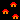
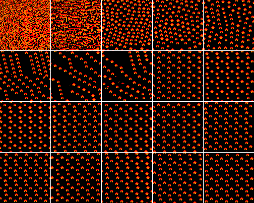
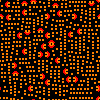
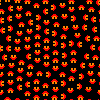
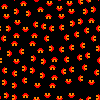
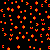

# Wave function collapse (Overlap model)

There are lots and good [explenations](https://discourse.processing.org/t/wave-collapse-function-algorithm-in-processing/12983) online available, which show what the algorithm is doing. But even with this i was not able to implement my own version.

 

So i searched github for a existing one, which i can translate into FreePascal and then improve to my own whishes. Finally i found [this](https://github.com/D-T-666/wave-function-collapse-p5). It has some easy to fix bugs (as it mirrors and somehow rotates the input image to the output only relevant, if symmetry flag is off).

Before diving into the code i highly recommend to read the explanations from above, otherwise this code is really hard to understand.
 
## How to use this program

1. Load a pattern image from the data folder
2. Set parameters

  | Parameter | Description |
  | --- | --- |
  | N | Affects the detailgrade of the subpatterns,    if set to small it could be, that you get garbage, if set to big you maybe could not get enough "new" content (see table below for more infos)
  |allow rotate | if set, the source pattern can "Rotate" freely, otherwise not (best to test with "demo-1.png")
  | wrap vertical | if not checked, the pattern can not cross the bottom / top border (test with "demo-flowers.png"). Disables allow rotate   ! Attention !  in order to work properly the image should not contain "pixels" that are used in the last row of the image
  | wrap horizontal | if not checked, the pattern can not cross the right / left border (test with "demo-flowers2.png"). Disables allow rotate   ! Attention !  in order to work properly the image should not contain "pixels" that are used in the last column of the image

3.  Hit "Init" button and wait until initialization is finished (this can take quit long if N is large)
4.  Define output width and height (typically ~40, but the only limit is the RAM of your machine and the time you want to wait until it is finished) or use the "Edit Preload" button to define preset cell values.
5.  Hit "Run" and enjoy image creation (after initialized once you can hit "Run" multiple times without the need to re Init).

## N - Parameter
As far as i can tell, N makes only sense in the Range: N = 2 up to N = Pattern.Width / 2 (which makes sense if you look from the "wave" viewpoint).

For better demonstration look at this picture  its dimension is 20 x 20 pixels. The table below shows the used N and the corresponding image in the grid below. All Images with N = 11 to 20 are "shifts" of more or less the same image (you can proof that by laying them over each other in a image editor).

All Images are created using: 
- allow rotate = off
- wrap vertical = on
- wrap horizontal = on

The following table shows the N used for the image creation
  N |    |    |    |    |
 -- | -- | -- | -- | -- 
  1 |  2 |  3 |  4 |  5
  6 |  7 |  8 |  9 | 10
 11 | 12 | 13 | 14 | 15
 16 | 17 | 18 | 19 | 20

Image creation took around something in the range from 4sec up to 30sec per image.

When allowing rotations the correct value of N is even more important, to demonstrate this i allowed rotation and tested again with different N values. In braket is the time it took to create the image on my machine.

|  N |  3 (0:40min) |  4 (0:47min) |  5 (2:18min) |  6 (6:26min) |  7 (11:34min) |
| -- | :-: | :-: | :-: | :-: | :-: 
|    |  |  |  |  |  |

Disallowing wraping makes no sense with the houses image, as to "Disable" wrapping it is crucial that the right / bottom line of the pattern holds pixel colors which are not part of the rest of the image!
