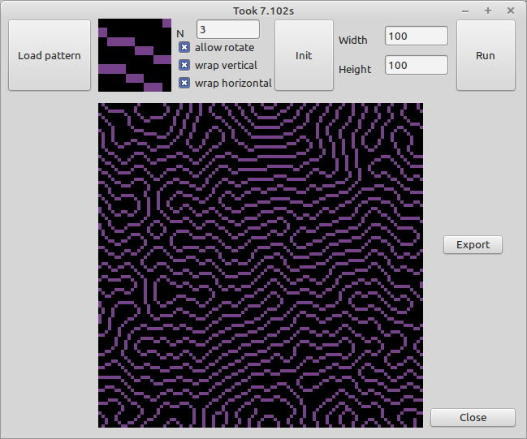
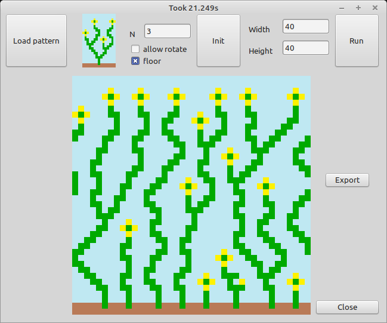

# Wave function collapse (Overlap model)

There are lots and good [explenations](https://discourse.processing.org/t/wave-collapse-function-algorithm-in-processing/12983) online available, which show what the algorithm is doing. But even with this i was not able to implement my own version.

 

So i searched github for a existing one, which i can translate into FreePascal and then improve to my own whishes. Finally i found [this](https://github.com/D-T-666/wave-function-collapse-p5). It has some easy to fix bugs (as it mirrors and somehow rotates the input image to the output only relevant, if symmetry flag is off).

Before diving into the code i highly recommend to read the explanations from above, otherwise this code is really hard to understand.
 
## How to use this program

1. Load a pattern image from the data folder
2. Set parameters

  | Parameter | Description |
  | --- | --- |
  | N | Affects the detailgrade of the subpatterns, typically you should set N somewhere between 2 and 7 (for the most sample images use 3)   if set to small it could be, that you get garbage, if set to big you maybe could not get enough "new" content
  |allow rotate | if set, the source pattern can "Rotate" freely, otherwise not (best to test with "demo-1.png")
  | wrap vertical | if not checked, the pattern can not cross the bottom / top border (test with "demo-flowers.png"). Disables allow rotate   ! Attention !  in order to work properly the image should not contain "pixels" that are used in the last row of the image
  | wrap horizontal | if not checked, the pattern can not cross the right / left border (test with "demo-flowers2.png"). Disables allow rotate   ! Attention !  in order to work properly the image should not contain "pixels" that are used in the last column of the image

3.  Hit int button and wait until initialization is finished (this can take quit long if N is large)
4.  Define output width and height (typically ~40, but the only limit is the RAM of your machine and the time you want to wait until it is finished)
5.  Hit run and enjoy image creation.

