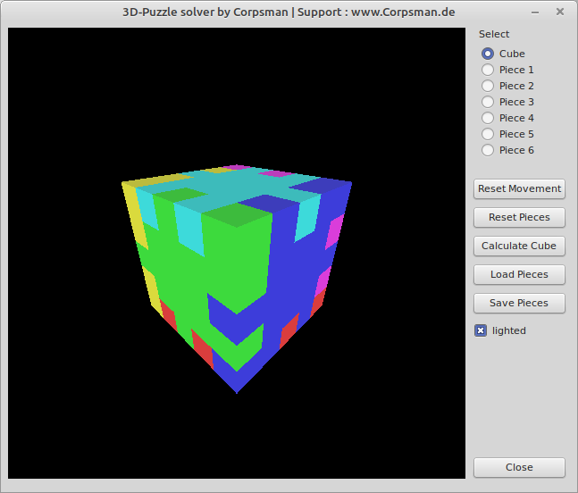

# 3D-Puzzle

This is a kind of [Affenpuzzle](../Affenpuzzle) but in 3D.

Features:
- edit pieces
- find first solution

Dependencies:
- OpenGL ([dglOpenGL](https://github.com/saschawillems/dglopengl) and TOpenGLControl from the LCL)
  
Needed Lazarus packages:

LazOpenGLContext