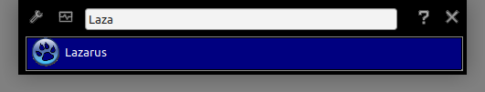

# ALT_F2

ALT_F2 is the keyboard shortcut Linux users typically use to open a quick starter application, that itself starts the searched and requested app.

This is the reimplementation of the KDE-Version of the ALT_F2 tool, but available for Windows and Linux.

I did this rewrite as i wanted to have a cool looking (and KDE looks cool), plattform independant version of the orig Linux version and came up with this.
With this tool your fingers learn a combination for a programm to start and no matter on which PC you are, its always the same. As it is also capable of starting explorer with a target directory you never need to learn new project folders if your boss is changing them "AGAIN". Just fix your shortcut and its done ;). 

This tool helps you clearing up your desktop from all this shortcuts to what ever, as it handles them all. And as the tool learns what you prefer, the longer you use it, the better are its suggestions.

Features:
- Custom Links
- Applications with parameters
- Custom Icons
- Calculator (start your search with "=" and type in the requested formular) [by editing settings.ini you can adjust more settings]
- shortcut to task overview
- automatic priorising of registered applications

Dependencies:
- [MP-Arith](https://web.archive.org/web/20190628091417/http://www.wolfgang-ehrhardt.de/index.html) or use this direct [Link](https://web.archive.org/web/20190702203624/http://www.wolfgang-ehrhardt.de/mparith_2018-11-27.zip)

Needed Lazarus packages:
- UniqueInstance

# What needs to be done to use it

- Windows user: 
  - copy a shortcut to the programm into your "autostart" folder and you are ready to use it.
- Linux user: 
  - Edit your global shortcut settings, disable the default ALT_F2 command
  - Create a new command targeting to the new ALT_F2 tool, and define the keyboard shortcut

If installed, type whenever you want the keyboard combinition ALT + F2 and the programm pops up. Start typing the name of the application you want to start, as soon as the requested app is the "first" in list, hit return to start (typicalli this happens after two or three charactes)

If you want to create a new shortcut just type in the name of the requested app and hit return. As the programm does not know what to do with it, it asks you to give the target link once. After you submit it, the app automatically calls the target link so you can proofe that everything is right (if not use the context menu)

## Hidden features

When the application is closed edit the ALT_F2.ini file, in the general section you see this:

> [General]
> 
> OpenWhereMouseIs=0 
> SkipIcons=0 
> ShowDetailedIntValues=1

| Option | Description |
| --- | --- |
| OpenWhereMouseIs | if set to 1 the application will popup on the screen where the mouse is located |
| SkipIcons | if set to 1, no icons will be loaded (deprecated) |
| ShowDetailedIntValues | if set to 1, when using the calculater the result will also displayed as HEX and binary number if it is a integer value (and small enough) |