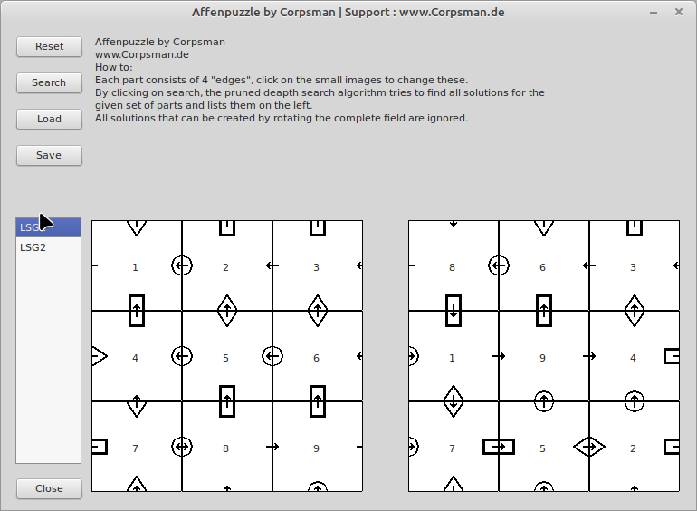

# Affenpuzzle

During my stay at the university we needed to code a solver for the "ape puzzles". Given is a set of 9 pieces, that have four different images on each side. The goal is to find a combination of these 9 pieces, so that all edges match up the correct way.

Searching the solution the "primitive" way (testing the matching parts in the order given below) 

> 1 2 3  
> 4 5 6  
> 7 8 9
 
will create way to much computing load (even on modern machines). This is due to the fact, that with this order the first "conflict" (and therfore pisible prune of the search tree) in choosing a piece is on the 5. try.

The clever strategy for solving this puzzle is to "prune" the search space as soon as possible, this can be done by changing the "search" pattern to the following one

> 8 2 4  
> 7 1 3  
> 9 5 6

with this the search tree can be pruned much faster and therefore the solution can be computed fast enough.

Features: 
- change "subelement" of each edge
- find all possible solutions
