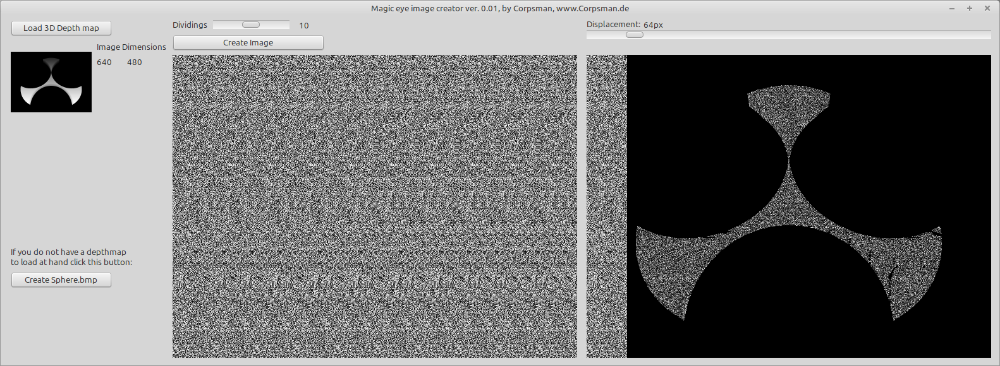

# Autosterogram

This demo tries to give the first insights on how to create [autostereograms](https://en.wikipedia.org/wiki/Autostereogram).

The application also provides a displacement test, with which you can try to make the hidden depth image visible. Yet missing is a feature that actually can extract the correct depth map. 

Features:
- Load a depthmap and create a pixel image
- create a depthmap for a sphere