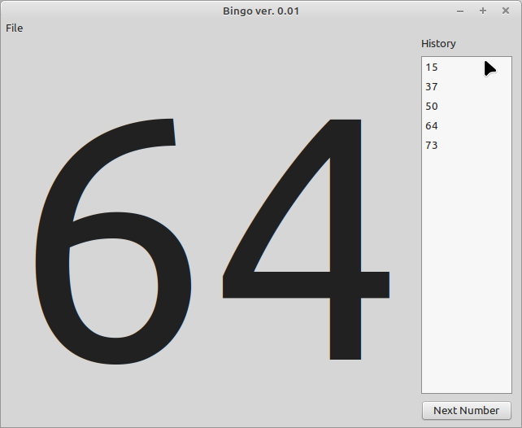
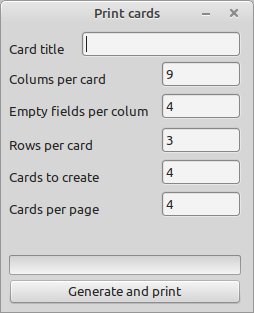

# Bingo

For the next party i needed a nice little Bingo app and was not able to find one that fits my needs ;).

Features:
- Print bingo cards 
- play bingo
- store number history on the screen side

Dependencies:
- none

Needed Lazarus packages:
- none

# What needs to be done to use it

- Compile and start the app
- Use the print feature to brint as many cards as needed  
- play the game and enjoy