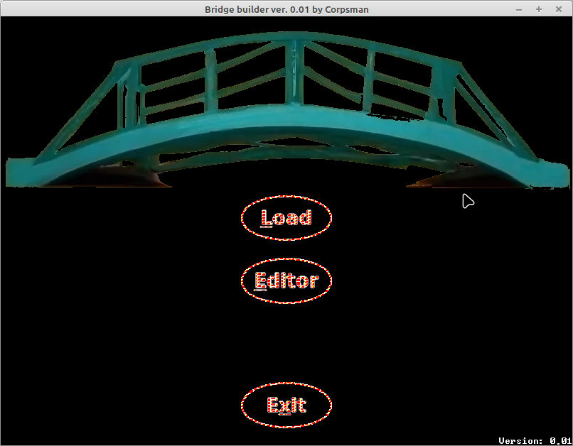

# Bridge builder

***! This game is a work in progress !***

I really like the idea of physics simulation and gamification, so i tried to implement my own version of a bridge builder.

Dependencies:
- OpenGL ([dglOpenGL](https://github.com/saschawillems/dglopengl) and TOpenGLControl from the LCL)

Ressources:
- Image creation: https://www.craiyon.com/