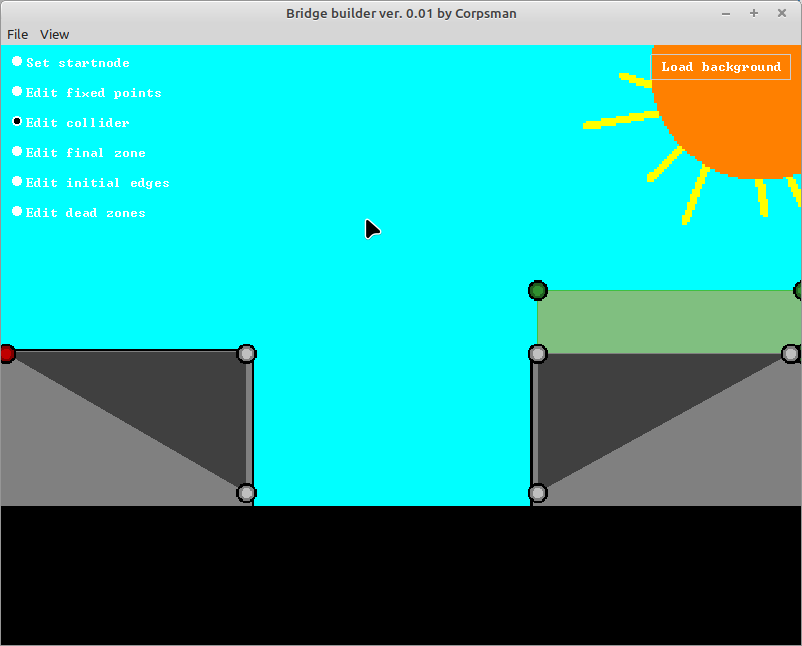
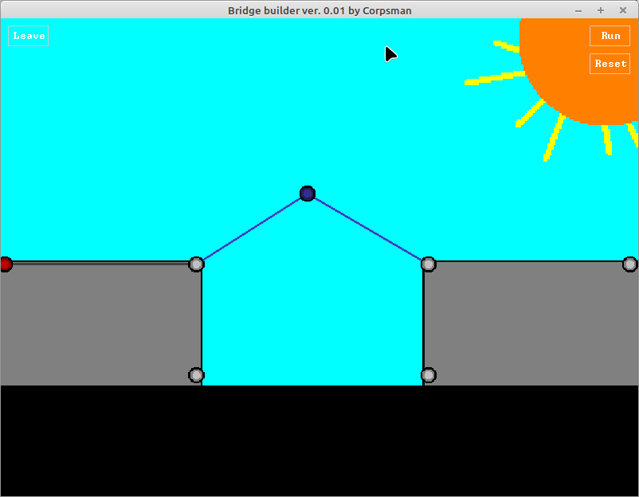

# Bridge builder

***! This game is a work in progress !***

I really like the idea of physics simulation and gamification, so i tried to implement my own version of a bridge builder.

#### Editor

#### In game

Dependencies:
- OpenGL ([dglOpenGL](https://github.com/saschawillems/dglopengl) and TOpenGLControl from the LCL)

Ressources:
- Image creation: https://www.craiyon.com/

## Manual
### Editor
| Input | description | 
| --- | --- |
| left mouse button | set edge / start with edge |
| SHIFT + left mouse button | set next edge and select point for next edge |
| right mouse button | abort / deselect actual operation |
| right mouse button + mouse movement | scroll the map |
| CTRL + mouse wheel (up / down) | zoom in / out |

### In game

| Input | description | 
| --- | --- |
| left mouse button | set edge / start with edge |
| SHIFT + left mouse button | set next edge and select point for next edge |
| right mouse button | abort / deselect actual operation |
| right mouse button + mouse movement | scroll the map |
| CTRL + mouse wheel (up / down) | zoom in / out |
