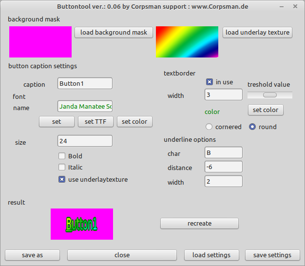

# Button Tool

If you create a game (or other application that not uses default controls) you need sometimes to paint your graphical elements by yourself. This Application helps creating fonts that look a little bit "cooler" than a simple colored text.

Features:
- Text Borders
- Text Masks
- Marking of letters
- Store / Load settings