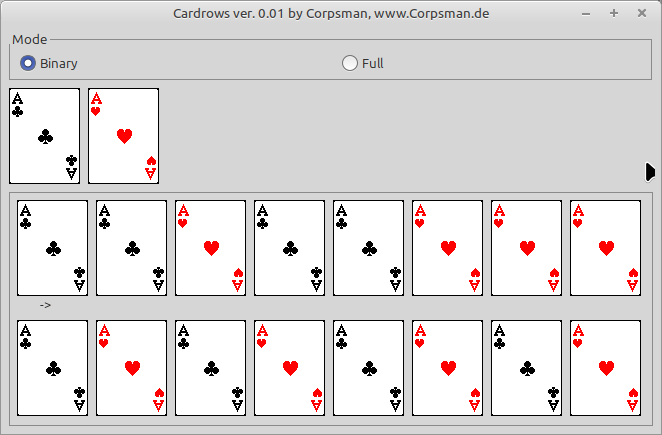

# CardRows

This small program is based on an idea from my childhood. Back in the days before mobile phones, people would get together to play. However, this is less of a game and more of a challenge: arranging the cards in the correct order.

The challenge is as follows:
Arrange a deck of cards so that, when the cards are dealt according to the following procedure, they end up in alternating colors.
The procedure is repeated until the deck is empty:

- Deal the top card
- Move the top card to the bottom of the deck

The program supports the "Binary" mode described above as well as a "Full" mode using all 32 cards of a Skat deck. Clicking the cards lets you define the desired final order; the required starting order is recalculated after each click, and the result is validated below.

Features:
- Binary mode
- Full mode
- Freely define the final order by clicking the cards

Dependencies:
- [Playingcards](https://github.com/PascalCorpsman/Examples/tree/master/graphics/Playingcards)
