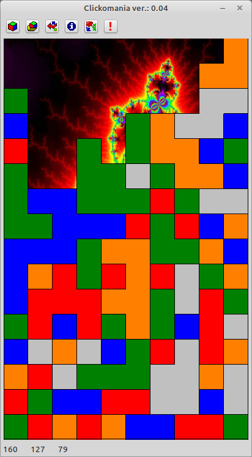

# Clickomania

This is the FPC reimplementation of the famous clickomania of from Matthias Schüssler (www.clickomania.ch)

Features:
- Highscore
- single player
- extra stones
- multiple graphic effects

---

Features compared to the original:

All diffs from the click.exe (Vers. 4.2.1.0) to clickomania are listed:

\- means Funktion / Feature is part of click.exe but not of clickomania 
\+ means Funktion / Feature is not part of click.exe but of clickomania

\- Stone, F/Xs Vojeur 
\+ Stone, Texture (scaleable Transparency) 
\- Stone, Sounds 
\- Background, fit image to window size (always enabled) 
\- Default Background (used a different) 
\- Actions, Enable auto drop/count down 
\- Spezial, Language 
\- Help 
\+ Highscore System "Low Score" and "High Score" runs always (but only the active one will bi shown) 
\+ Highscore System "High Score" gives extra points if more than 90% of Field where destroyed 
\+ Highscore System is depending on (FieldWidth, FieldHeight, ColorCount, UseSpezial) changing one value, will give a different highscore table 

Dependencies:
- OpenGL ([dglOpenGL](https://github.com/saschawillems/dglopengl) and TOpenGLControl from the LCL)
  
Needed Lazarus packages:

LazOpenGLContext