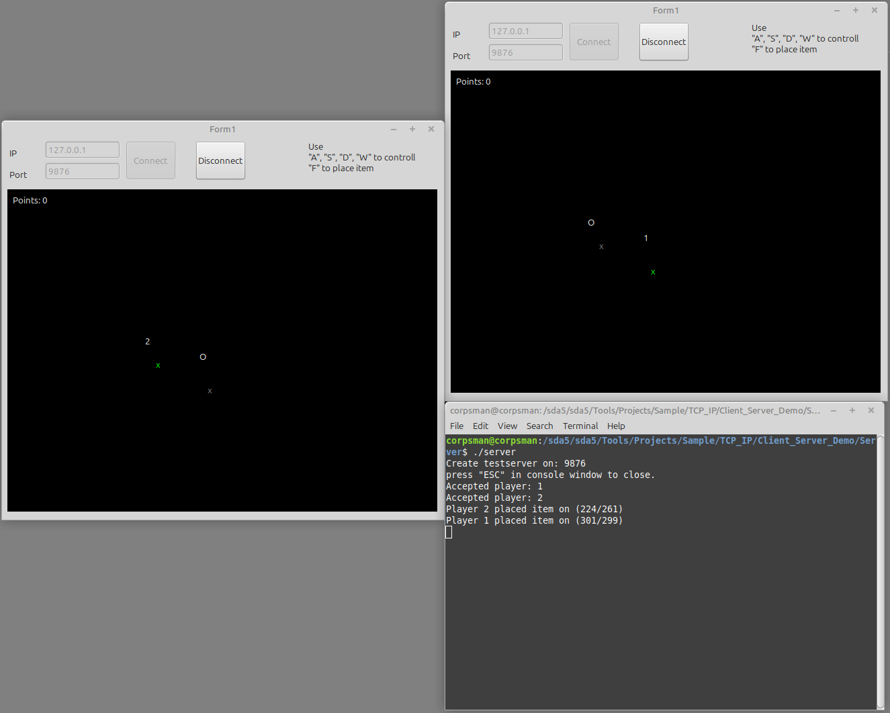

# Client server demo

Writing a application with one server and multiple clients is not easy.
This demo tries to show at least one way on how this task can be solved. Core of the demo is the chunkmanager.pas which makes this task a easy job.

The demo shows how:
- to implement a separate server that collects all client data and shares them to all other clients
- how multiple events can be send over the same socket 
- Implements a "minigame", each player places "items" which than can be collected by the other players
- Join and leave player is possible at every time

Dependencies:
- Lnet ( https://github.com/almindor/lnet )
