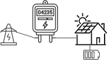
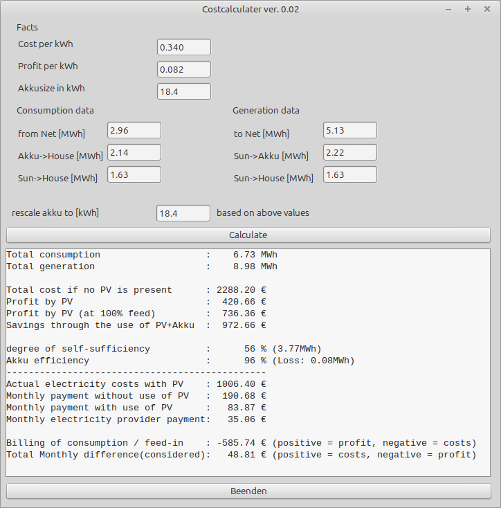

# Cost calculator

I am a owner of a photovoltaic system and was curious how effective the system is. If you have all data of consumption and generation you can play with the numbers to see different impact values ;).

The application expects the following "topology":

A House including a battery and photovoltaic system connected over a measuring device to the public current system. 

At least in germany this topology makes sense as the price for "selling" energy to the public is way less than "buying" from the public.

| Value | Description |
| --- | --- |
| Cost per kWh | the amount you have to pay for 1 kWh
| Profit per kWh | the amount you get payed for providing 1kWh
| Akkusize in kWh | the size of the battery
| from Net [MWh] | the amount of energy which actually was consumed by your house from the net
| Akku->House [MWh] | the amount of energy which was transfered from akku to house
| Sun->House [MWh] | the amount of energy which was directly feed from the sun to the house
| to Net [MWh] | the amount of energy which was provided to the net (not used)
| Sun->Akku [MWh] | the amount of energy that was used to recharge the akku

Features:
- adjustable akku capacity
- adjustable costs
