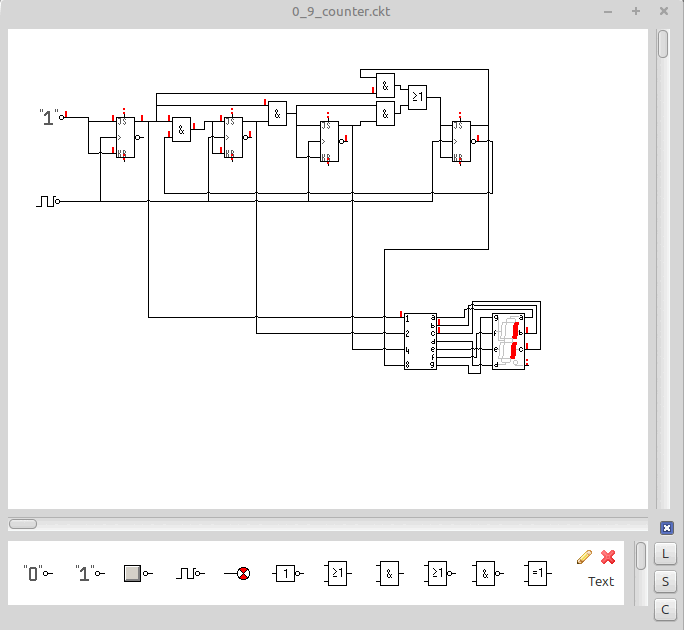

# Digiman2

This is the cleanup from my [digiman](https://corpsman.de/index.php?doc=beispiele/digiman) version from 2008. It is a complete new implementation using object orientation and clean code techniques ;).

Features:
- Load / save
- Simulate in realtime
- Basic logic elements (or, and, not..)
- High level logic elements (flipflops, adder, decoder ..) (not yet fully implemented)