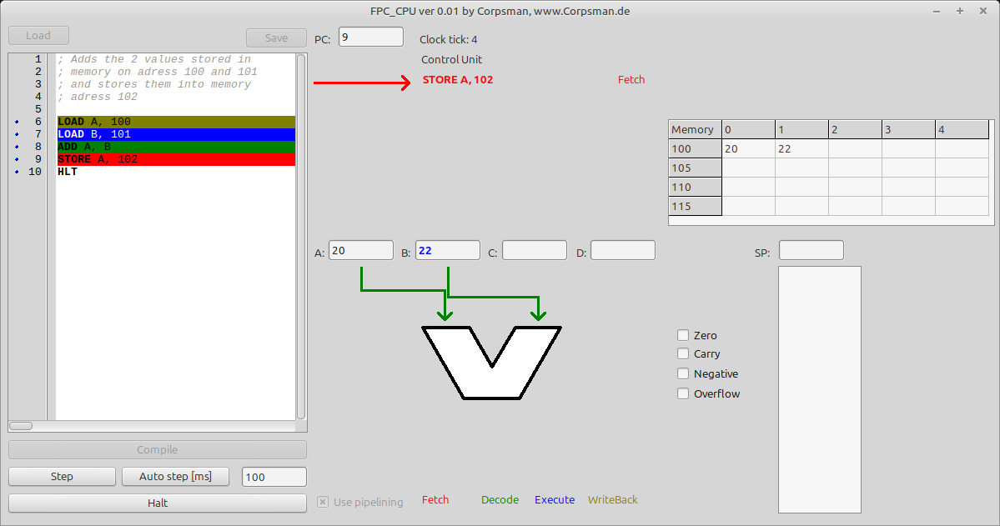

# FPC_CPU

> ! Attention !
> This is a work in progress

Demo that visualized the execution of assembler code in a CPU (using a 4 stage pipeline). This also means, if no pipelining is used each and every command needs 4 clock ticks.

See the [Manual](Manual.md) for supported cmd's.

Features:
- Execution of ASSEMBLER Code (step by step or automatic mode)
- Optional Pipelining
- Breakpoints
- Memory / Stack

Dependencies:
- none