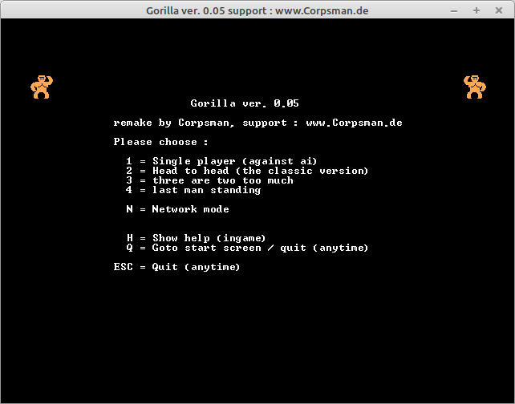

# Gorilla

This is a reimplementation of the DOS game gorilla.bas, with some new features like, network, ai and up to 4 player mode.

Features:
- 4-Player Game
- network game
- ai

Dependencies:
- OpenGL ([dglOpenGL](https://github.com/saschawillems/dglopengl) and TOpenGLControl from the LCL)
- Lnet ( https://github.com/almindor/lnet )

Needed Lazarus packages:

LazOpenGLContext
