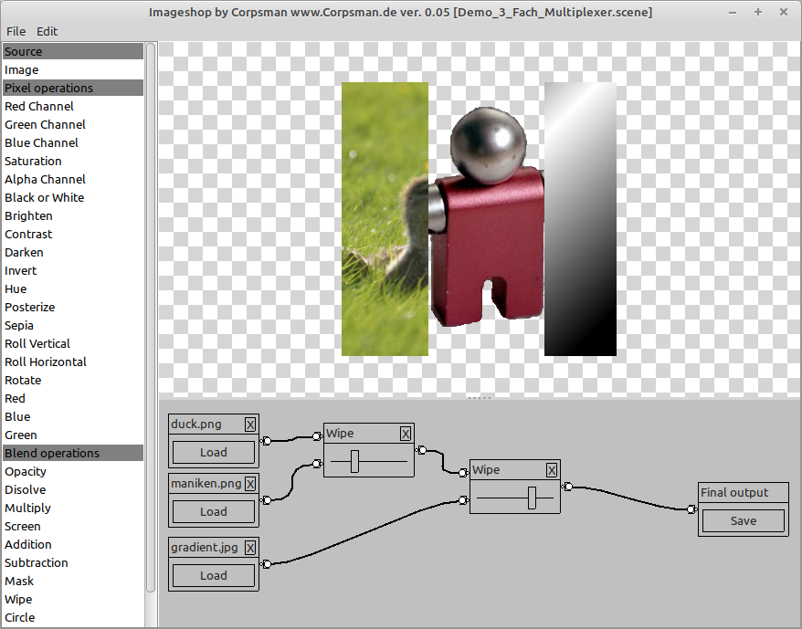

# Imageshop

Inspired by [Imageshop](https://github.com/sysrpl/Codebot.ImageShop/tree/master) by Anthony Walter. This is my own interpretation of a image manipulating program.

Features:
- Load/ save scenes
- Operands are boxes which can be connected, using a graphical editor
- Integrated FPC interpreter to define new operands without the need of recompiling

How to use:
- Click on "Image" on the left and click on the graphical editor to create a image load box.
- Load a image
- connect the output of the image load box to the input of the Final output box (via drag drop)
- use mouse scroll wheel to zoom
- to delete a connection, redo the drag drop process for a existing line.

Dependencies:
- OpenGL ([dglOpenGL](https://github.com/saschawillems/dglopengl) and TOpenGLControl from the LCL)