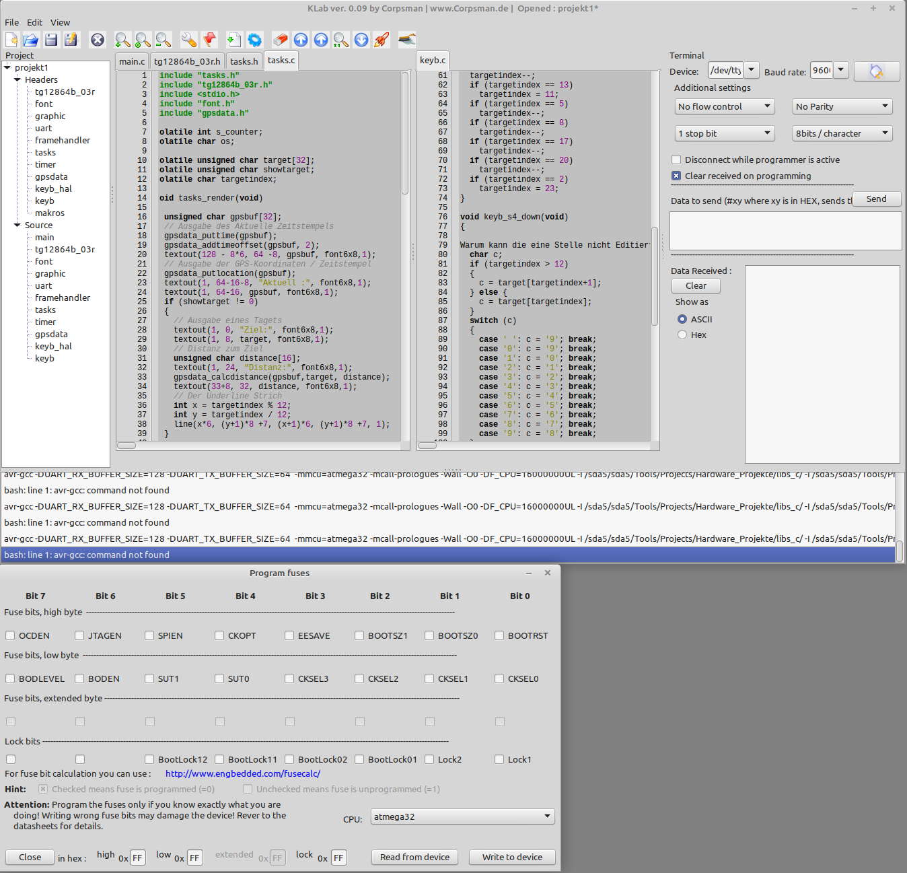

# KLab

IDE for Atmel(r) AVR(c) microcontroller projects inspired by [KontrollerLab](https://sourceforge.net/projects/kontrollerlab/)

Features:
- read / write Fuse Bits
- program hex files
- Erase µ-controller
- Verify fex files
- cleanup temporary files from harddisc
- two separate source windows
- Project manager
- debug terminal
- show compiler warnings during compile
- show ram statistics of µ-controller
- support searchpaths
- compile with one click (gear button)
- compile and flash with one click (rocket button)
- Support of new cpu's by ini files (see subfolder cpu for more informations)
- custom codehighlighting

Dependencies:
- Synapse ( http://www.ararat.cz/synapse/doku.php/download ) 

## What neets to be done to use the IDE
- AVR-GCC Toolchain
- AVR-Dude 
- USB programmer e.g. from http://www.ulrich-radig.de 