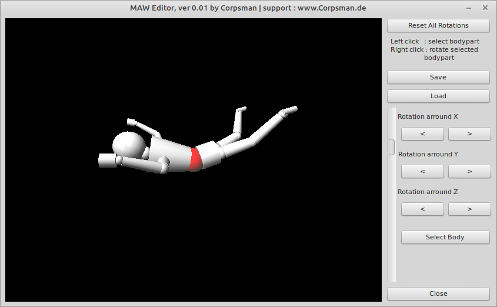

# MAW (Marionétte at work)

This little demo shows how to pick and rotate OpenGL objects with a little puppet example.

Features:
- load / store
- pick by click
- rotate a clicked object

Dependencies:

DGLOpenGL ( https://github.com/saschawillems/dglopengl )

Needed Lazarus packages:

LazOpenGLContext
