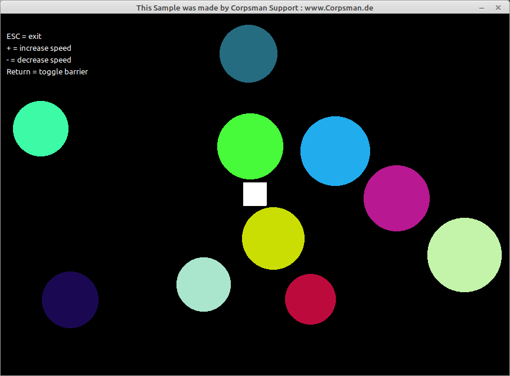

# PingPong

This is a most simple demo, on how to write ball <-> ball, ball <-> brick, ball <-> wall collision. The demo explicit does not use OpenGL or any other fancy render engines to be as simple as possible

Features: 
- adjust simulation speed
- toggle "barrier"
