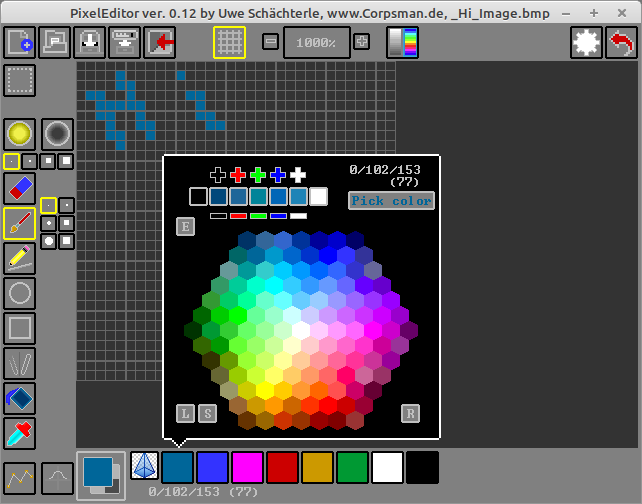

# PixelEditor

***! This application is a work in progress !***

My most favorite image editing program is kolourpaint. Unfortunatunelly kolourpaint is not the best when drawing pixelart images (which are needed for e.g. [Config TD](https://github.com/PascalCorpsman/ConfigTD)). After some research i found these two

- https://makepixelart.com/free#
- https://www.piskelapp.com/p/create/sprite

both are good, but do not perfectly fit my needs. So i decided to write my own pixel editing program.

As this is a work in progress i do not have a screenshot of the project yet, instead the "vision" is shown.

Features:
- create pixelart

If you want to get more informations about "How to use the PixelEditor" read the [manual](manual.md)

Dependencies:
- OpenGL ([dglOpenGL](https://github.com/saschawillems/dglopengl) and TOpenGLControl from the LCL)
  
Needed Lazarus packages:

LazOpenGLContext