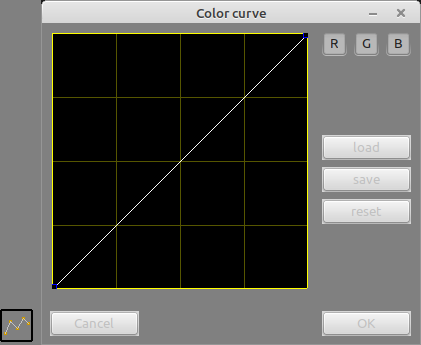

# Usermanual for PixelEditor

This is the usermanual for Pixeleditor, mainly to show the "hidden" features like key combinations and other stuff.

## Installation

- Download the executable from the [bin](bin) subfolder and store it onto your harddrive
- create a subfolder named "GFX" where you stored the executable and copy all files from [GFX](GFX) into this folder
- [Linux users only], chmod +x the executable

Run the executable and enjoy ;).

## Mouse actions
| Action | Description |
| --- | ---
| wheel (up/down)| zoom (in/out)
| CTRL + Left | Copies selection to image before drag
| Right | when clicked inside a selected area gives access to additional features (see below)
| double Right | access to background image dialog 

## Keyboard actions
Keyboard commands:

### top line
| Action | Description |
| --- | ---
| CTRL + N | New image
| CTRL + L | Open "Load dialog"
| CTRL + S | Save / Save as
| ALT + F4 | Close pixeleditor
| CTRL + G | toggle grid view
| + / - | Zoom in / out
| X | toggle color/monochron view
| CTRL + O | show options dialog
| CTRL + Z | Undo last pixeloperation

### Tools
| Action | Description |
| --- | ---
| S | select "select" tool
| SHIFT + R | rotate image / selection 90° counter clock wise
| SHIFT + H | horizontal flip image / selection
| SHIFT + V | vertical flip image / selection
| SHIFT + A | open rotate by angle dialog
| Cursors | "move" selected subimage
| ESC | skips actual selection / terminates application in error mode
| B | select "brighten" tool
| D | select "darken" tool
| DEL + BACK | select "eraser" tool / clears "selected" subimage if something is selected
| 1 | cursor size 1
| 2 | cursor size 2
| 3 | cursor size 3
| 4 | cursor size 4
| SHIFT + 1 | round cursor size 1
| SHIFT + 2 | square cursor size 1
| SHIFT + 3 | round cursor size 2
| SHIFT + 4 | square cursor size 2
| SHIFT + 5 | round cursor size 3
| SHIFT + 6 | square cursor size 3
| P | select "pencil" tool
| L | select "line" tool
| E | select "ellipse" tool
| R | select "rectangle" tool
| O | select "outline" option, when rectangle / ellipse tool is active
| F | select "filled" option, when rectangle / ellipse tool is active
| M | select "mirror" tool, toggles between 4-achses/ mirror horizontal / mirror vertical
| C | select toggle "mirror on pixeledge / pixelcenter" option, when mirror tool is active
| SHIFT + M | unselect "mirror" tool
| SHIFT + B | select "bucket" tool
| T | opens color toleranze dialog
| I | select "pipette" tool
| U | opens color curve dialog

### Colors
| Action | Description |
| --- | ---
| CTRL + 1 | select color / open color 1 dialog
| CTRL + 2 | select color / open color 2 dialog
| CTRL + 3 | select color / open color 3 dialog
| CTRL + 4 | select color / open color 4 dialog
| CTRL + 5 | select color / open color 5 dialog
| CTRL + 6 | select color / open color 6 dialog
| CTRL + 7 | select color / open color 7 dialog
| CTRL + 8 | select color / open color 8 dialog

### Leneral
| Action | Description |
| --- | ---
| CTRL + E | Open Resize dialog (for selected or image)
| SHIFT | when pressed during line / rectangle / ellipse creation the shape will be forced to be equal in width / height
| CTRL + A | Select all
| CTRL + C | Copy selected / all
| CTRL + X | Cut selected / all
| CTRL + V | paste image from clipboard

## The color match dialog

The select by color and the floodfill (bucket) feature are dependant to the color match settings.

You can switch between "Exact match" and 1% .. 30%. This feature is espacially helpfull if you want to work with dithered images (like compressed JPEG).

## Select context menu

When clicking with the right mouse button into a selected subimage you get access to the additional features

| Name | Description |
| --- | ---
| Copy selection to clipboard | copies whatever is selected as bitmap into the clipboard
| Export selection | Exports whatever is selected as image
| Convert to grayscale | converts all pixels into grayscale values
| Invert colors | inverts the colors using the RGB-Cube
| Spritify | surrounds the selected image (using transparent to detect the border) with the selected color
| Select by color | selects inside the selection all pixels that match the selected color
| Invert selection | inverts the selection of the pixels inside the actual selection
| Hide | hides the contextmenu

## Edit background image menu

Menu is activated by double right click on the image area (without any selection)

| Name | Description |
| --- | ---
| Load background image | Loads a arbiture image as "background" image, replacing the transparent pattern if enabled
| Clear background image | clears the background image

If set the background image will always be scaled to the image dimensions.

## Color curve menu

Manipulate the colors of selection or the whole image

Choose the desirec colorchannels at the right top corner. Load a predifined colorcurve, or use
- left mouse to create new points, move existing
- right mouse to delete points
  
on the curve editor on the left side.

### pro tip
> the .curve files can be edited via a text editor