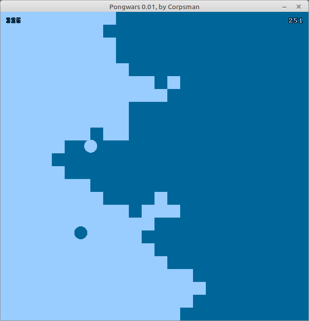

# Pongwars

Inspired by [this](https://github.com/vnglst/pong-wars) version of Pong-Wars i wanted to have my own version implemented in FreePascal.

This miniproject is more a simulation than a real application, anyway you can use some application parameters:

| parameter | description | 
| --- | --- |
| jitter | <true> / <false>, enables / disables the angle / speed jittering (default is <true>) |
| pause | <true> / <false>, starts in pause mode or not (use "space" to toggle pause) |

Features:
- console parameters

Dependencies:
- OpenGL ([dglOpenGL](https://github.com/saschawillems/dglopengl) and TOpenGLControl from the LCL)
  
Needed Lazarus packages:

LazOpenGLContext