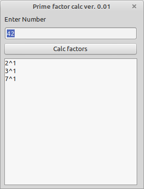

# Prime factorizer

With this application you can calculate the prime factorization of a single number between 2 and 2^64-1. The algorithm is quite nice as it itself does not calc prime numbers to do so.

## Use cases
* calc prime factors of a given number

