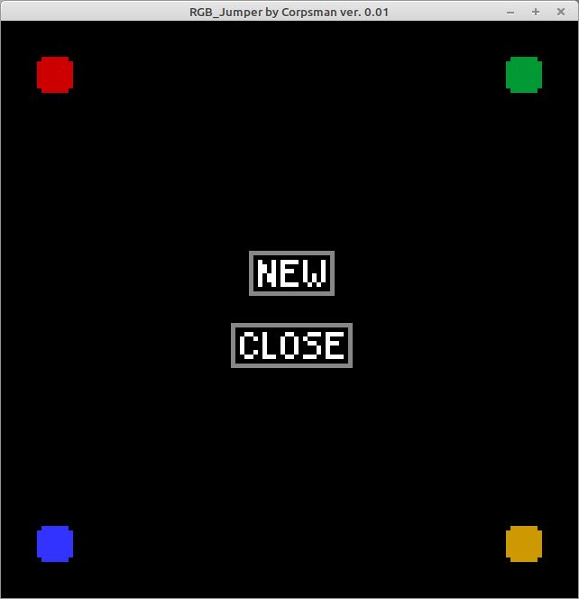
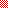
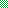
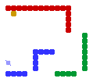

# RGB Jumper

This is a tiny jump and run game, inspired by a youtube [video](https://www.youtube.com/watch?si=RHmTvQ5xc-BMPEPb&v=YtylfQq2JII&feature=youtu.be) (10:16) i recently saw..

The main idea of the game is to "run" to the golden block. The player can change colors by either typing the "r", "g", "b" keys (or "c" to cycle colors). Collision is only to Map tiles with the same color.

Features:
- Pixelart
- Singleplayer
- Puzzle game
- Jump and run game

## whats needed to play the game
- download the corresponding bin file and the subfolder "GFX" / "Levels" and store it in the same directory
  
  or

- clone this repository and compile the sourcecode (see below for dependencies)

# Usermanual

The levels are simple .png files, all colors except the ones used below are ignored.
A tile is 8x8 pixel, all maps sizes need to be devidable by 8. Best way to create new levels is by using the [PixelEditor](../PixelEditor) and set its transparency grid to 8.

 = Player start position 
 = Reach this area to finish a level 
, ,  = player in different colors 
, ,  = when player touches this field, its color is instant changed to corresponding one. 

Player start and color changer can be merged into the same spot.

### Example:

Dependencies:
- OpenGL ([dglOpenGL](https://github.com/saschawillems/dglopengl) and TOpenGLControl from the LCL)
  
Needed Lazarus packages:

LazOpenGLContext