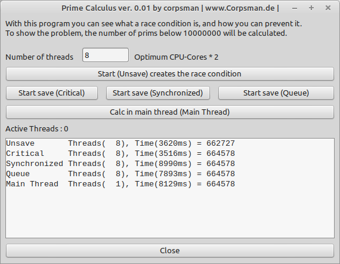

# Race Condition

Demo that shows how to (not) use TThread class to do havy calculations.

Features:
- 1 example (how to do it wrong)
- 4 different way's (to do it right)
- Calculates time and result for calculations