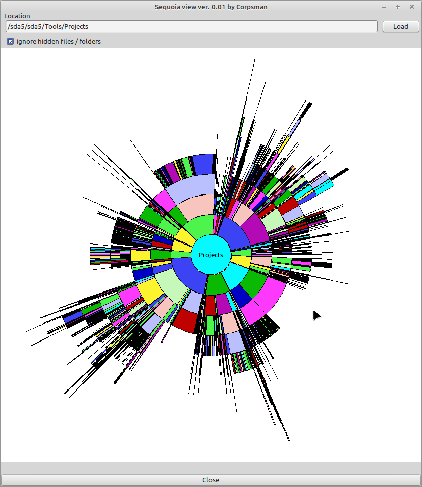

# Sequoia

Inspired by [SequoiaView](https://sequoiaview.de.softonic.com/) i wanted to have my own version that is free and plattform independant. As i also prever the circular view instead of the reactangular, i took this as a small sunday morning task to implement ;).

This Miniproject is also a nice demo for my [Sunburst](https://github.com/PascalCorpsman/Examples/tree/master/graphics/SunburstChart) chart component.

Features:
- drag & drop
- shows file sizes in correct relation
- "zoom in/out" with left and right mouse click 

Dependencies:

Sunburst ( https://github.com/PascalCorpsman/Examples/tree/master/graphics/SunburstChart )

Needed Lazarus packages:

none
