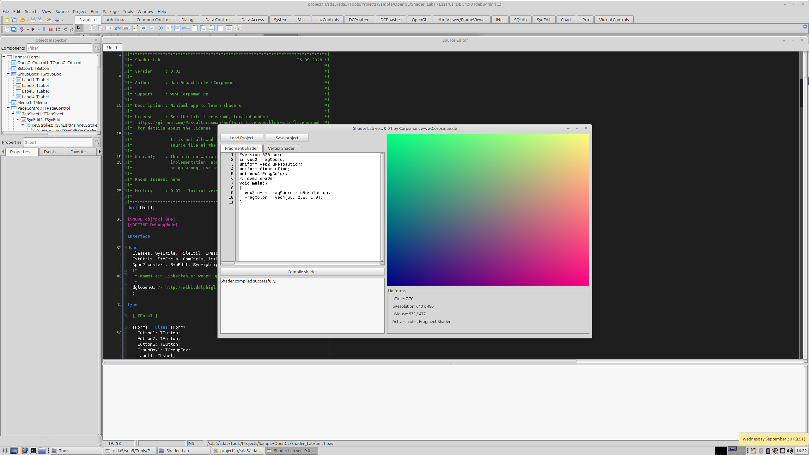

# Shader Lab

Shader Lab is a small experimental playground for learning modern 2D shader programming with FreePascal and OpenGL.
It is intentionally kept compact so you can change shader code, compile it immediately, and see the result without distractions.

## Features

- Live shader editing
- Fragment and vertex shader tabs
- Immediate compile and preview feedback
- Basic GLSL syntax highlighting
- Uniforms for time and resolution
- A minimal OpenGL 2D preview setup

## First Exercises

Try these tasks directly in the app to get a feel for how shaders work:

1. Render a constant color.
2. Build a horizontal or vertical gradient from `uv`.
3. Normalize coordinates with `fragCoord / uResolution`.
4. Draw a circle with `distance()`.
5. Use `step()` or `smoothstep()` to create a mask.
6. Animate a value with `uTime` and `sin()`.
7. Drive color or shape changes with `uMouse`.
8. Modify the vertex shader to scale, move, or rotate the quad.
9. Compare `fragCoord`, `uv`, `uMouse`, and `gl_FragCoord` to understand where each coordinate comes from.
10. Display the generated checkerboard texture by sampling a `sampler2D`.