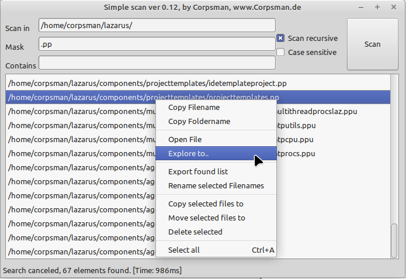

# Simple Search

Simple search is a Win98 like search dialog.

Features:
- Search for files
- Search in files
- Export search results
- Rename multiple files

Dependencies:
- [NativeDragDrop](https://github.com/prof7bit/NativeDragDrop) (Windows users, maybe need to add this [Pull request](https://github.com/prof7bit/NativeDragDrop/pull/1))