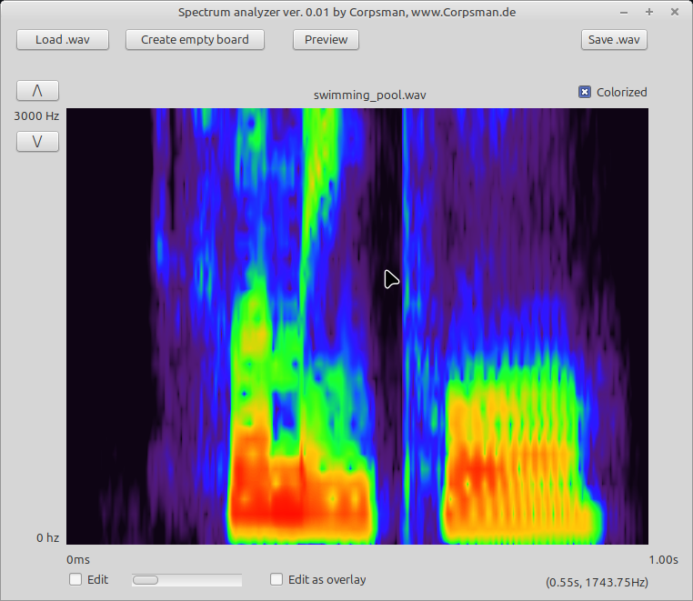

# Spectrum anayzer

Inspired by this youtube [video](https://youtu.be/08mmKNLQVHU?si=awNvvyid7AtpUwza) i wanted to have my own version in FreePascal ;).

Features:
- Open and show frequency over time spectrum
- "Draw" own frequencies
- Preview Loaded sound -- Not implemented yet
- Store own drawn frecuences

If you want to validate the correct representation of the results you can use [this](https://academo.org/demos/spectrum-analyzer/) website.

## What needs to be done to compile the application
- Download and install FFTW from (https://www.fftw.org/)
- Download and instll Bass from (https://www.un4seen.com/)
