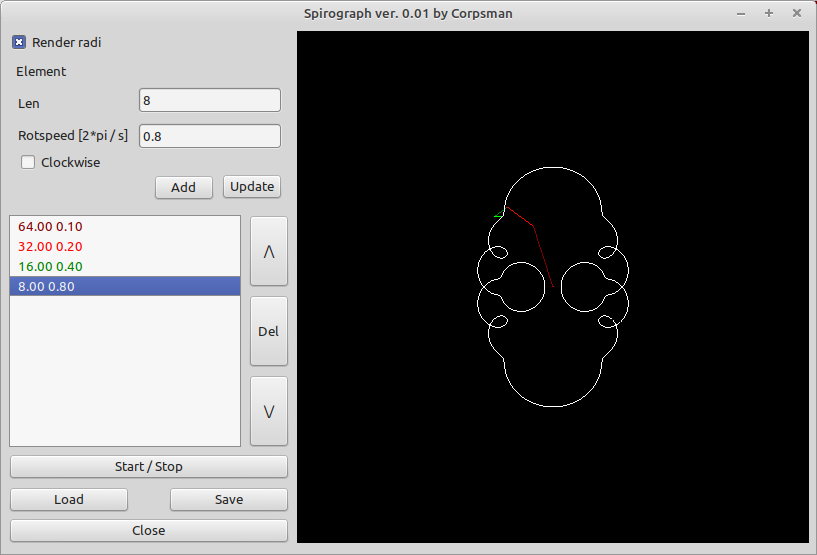

# Spirograph

Inspired by a youtube short i tried to implement this nice little thing, that can plot arbiture rotational figures.

Features:

- define arbiture "armlength" and rotatations
- simulate

Dependencies:

DGLOpenGL ( https://github.com/saschawillems/dglopengl )

Needed Lazarus packages:

LazOpenGLContext
