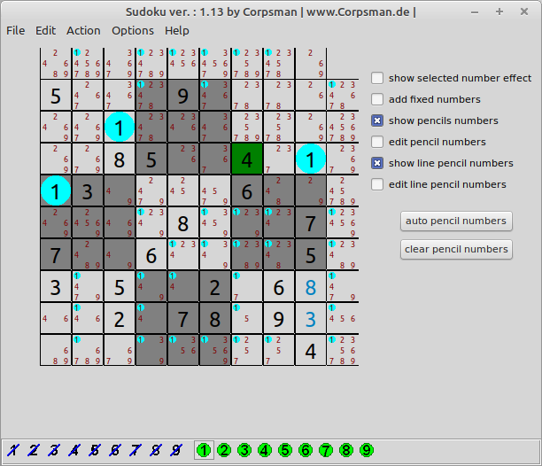

# Sudoku

Initially writen in Delphi 5 (and first published 2005 on https://www.Corpsman.de) this code was later ported to Lazarus and then "forgotten". On Request i now publish the code with more or less no changes. So be prepared. This code is a mess, but also a proof that even bad code can create a nice looking program. The App itself should be fully usable and is able to create puzzles for different solving strategies.

Features:
- Load/ save 
- 2x2, 3x3, 4x4, 5x5 Sudoku's
- different solving strategies

Dependencies:
- none