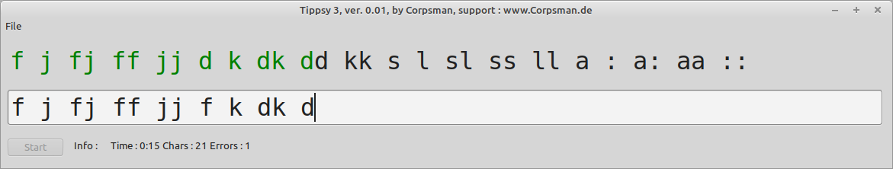

# Tippsy3

Tippsy3 is a applaication to learn and test the 10 finger writings

Features:
- Exercise / test mode
- Statistic evaluations

## content of the exercise files

- The exercise files are textfiles stored in UTF8.
- The first 4 lines are the "configuration", the rest is the exercise

Following the explanation of the first 4 lines

| Line Number | Values | Description | Example
| --- | --- | --- | --- |
| 1 | true / false | defines if test mode or "normal" mode | Hidden = false
| 2 | <number> | in test mode gives the number of seconds the editing is enabled | Time = 0
| 3 | <string> | gives the password in test mode to unlock the application | UnlockPW = 
| 4 | true / false | select if progress is shown in a different color | Colored = true

Additional you can look into the lesson / test example files.