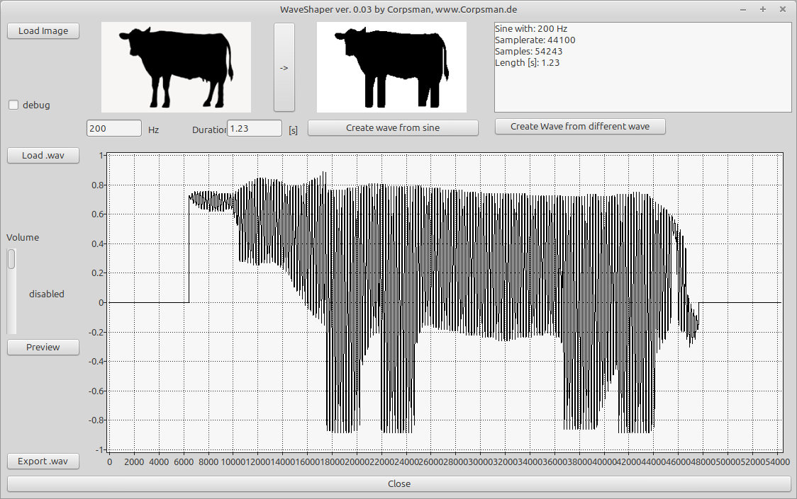

# WaveShaper

Inspired by this Youtube [Video](https://youtu.be/qeUAHHPt-LY?si=haVvvZ1xqHj8FCQ9) i tried to implement my own version of that "problem".

Dependencies:
- bass.pas, download it from [here](https://www.un4seen.com/)

## Usage
Start the application.
- Load Image (it should wider than taler)
- click "->" button to see the target wave shape that will be possible (ignore the red dots..)
- If everything is fine you can 
   1. Create a sinewave in the shape of to image or
   2. Load a different .wav file that will be reshaped to the new shape (not yet implemented)