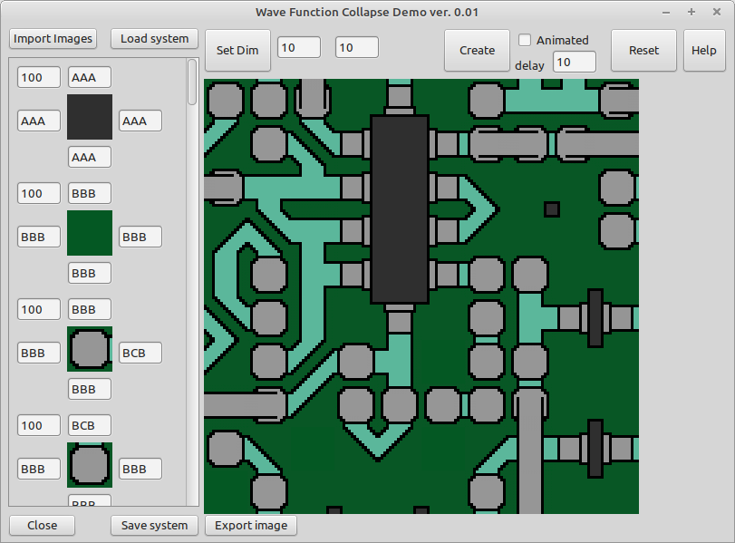

# Wave function collapse (Tile model)

This is the demo application for the wave function collapse "Tile mode" version.

Features:
- Select arbiture Images
- Define edges and propabillities for each image
- Create a filled surface
- Create a filled surface with animation

! Attention !
As the program uses a "Backjump" algorithm to do backtracking during creation, this could sometimes leed to very long creation times (see in app warnings).